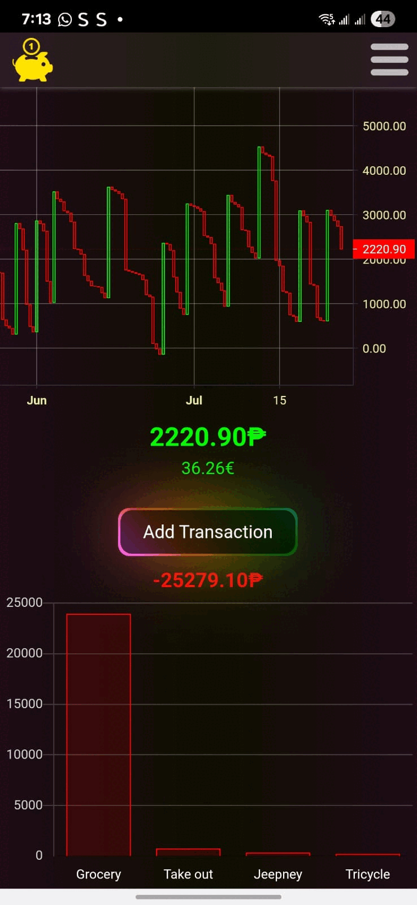
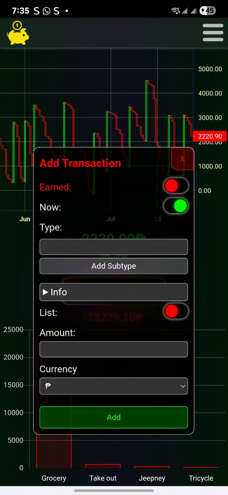
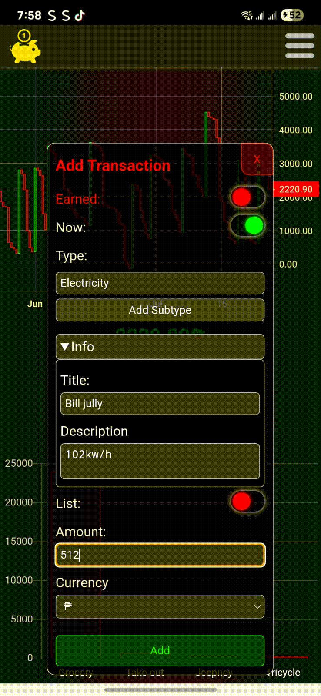
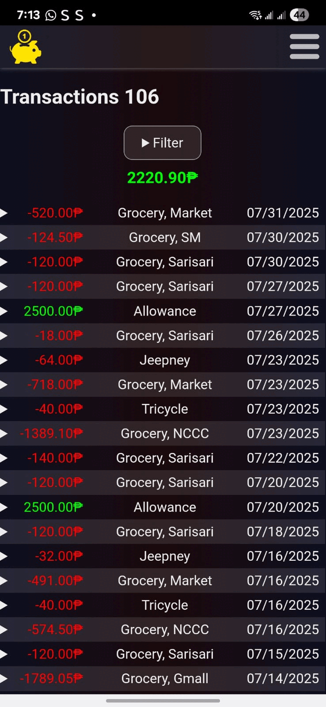
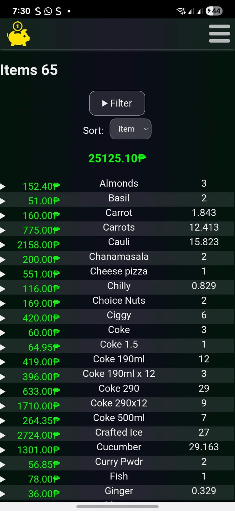
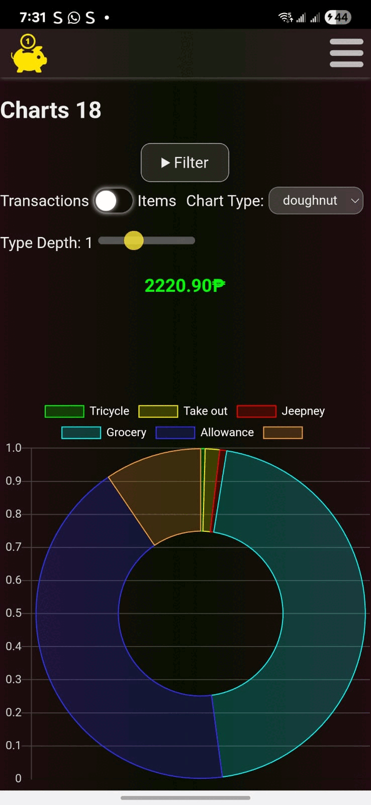
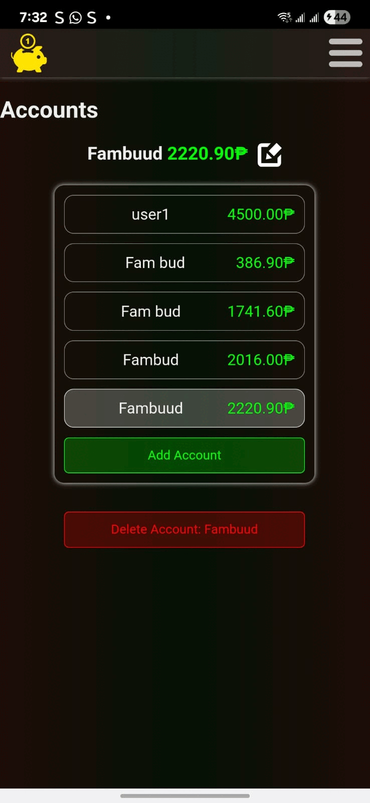
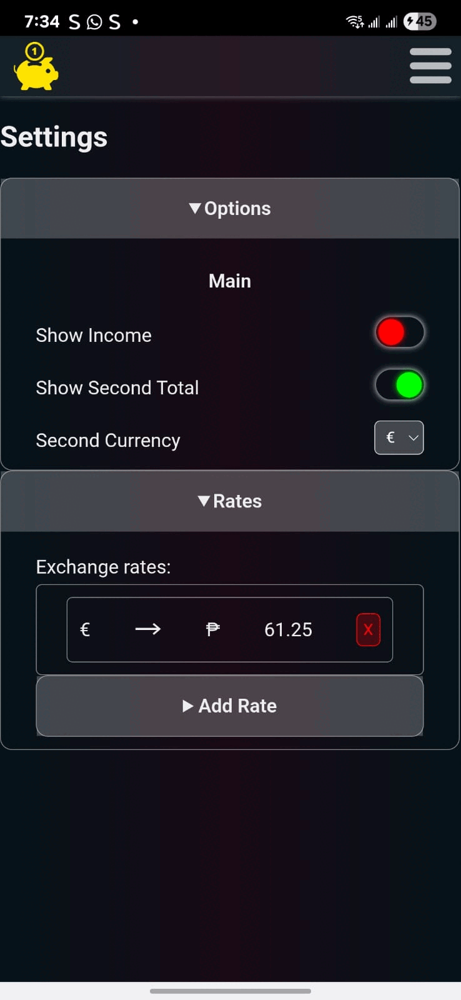

# Spender App - Personal Finance Manager

Spender is a React expense tracker app built to help you manage your finances efficiently. It allows you to record income and expenses, categorize transactions, and view summaries for better financial planning.

## Features

- Add income and expense entries
- Attach a list of items to transactions and track individual items
- Categorize transactions (e.g., Food, Transport, Utilities)
- View transaction history
- Generate summary reports
- Manage multiple accounts
- Data persistence with IndexedDB
- Android APK with WebView integration

## Installation

1. Clone the repository:

```bash
  git clone https://github.com/gijs-d/Spender-App-Personal-Finance-Manager.git
```

2. Navigate to the project directory:

```bash
  cd Spender-App-Personal-Finance-Manager
```

3. Open `dist/index.html` in your preferred browser to run the application locally.

### Android App

1. Download the `spender.apk` file from the repository or your preferred location.

2. Enable installation from unknown sources on your Android device:

    - Go to **Settings** \> **Security** \> **Install unknown apps**.

    - Select the app (e.g., your file manager or browser) and enable **Allow from this source**.

3. Locate the downloaded `spender.apk` file on your device.

4. Tap on the APK file to install the app.

5. Open the app to start tracking your expenses.

## Technologies

- HTML5
- CSS3
- JavaScript
- React
- IndexedDB

## Screenshots

### start



### transaction




### transactions



### items



### charts



### accounts



### settings


